# Todo App CI/CD Assignment
### Phuntsho Namgyel — 02240354

---

## Student Information
- **Name:** Phuntsho Namgyel
- **Student ID:** 02240354
- **Module:** DSO101 - Continuous Integration and Continuous Deployment

---

## Application Overview

For this assignment, I built and deployed a full-stack Todo List web application. The goal was to go through the entire CI/CD workflow. This involved writing the code locally, packaging it with Docker, pushing it to Docker Hub, and finally deploying it on Render with automatic deployments triggered by GitHub commits.

---

## Technology Stack

| Layer | Technology |
|-------|-----------|
| **Frontend** | React |
| **Backend** | Node.js with Express |
| **Database** | PostgreSQL (Render Managed Database) |
| **Containerization** | Docker |
| **Container Registry** | Docker Hub |
| **Cloud Deployment** | Render |
| **Version Control** | GitHub |

### Features
- Add tasks
- Edit tasks
- Delete tasks
- Mark tasks as complete

---

## Step 0: Prerequisites - Simple Web Application

Before setting up any deployment pipeline, I first built the actual Todo application. The frontend is a React app that communicates with a Node.js/Express backend, which stores tasks in a PostgreSQL database. Environment variables were used to keep sensitive information like database credentials and API URLs out of the codebase.

### Environment Variables
Backend `.env`:
```env
DB_HOST=localhost
DB_USER=postgres
DB_PASSWORD=postgres
DB_NAME=tododb
DB_PORT=5432
PORT=5000
```

Frontend `.env`:
```env
REACT_APP_API_URL=http://localhost:5000
```

I added `.env` to `.gitignore` to make sure credentials are never committed to GitHub. These variables are later configured directly in Render's environment settings during deployment.

### GitHub Repository Created
I created a GitHub repository following the required naming convention for submission.

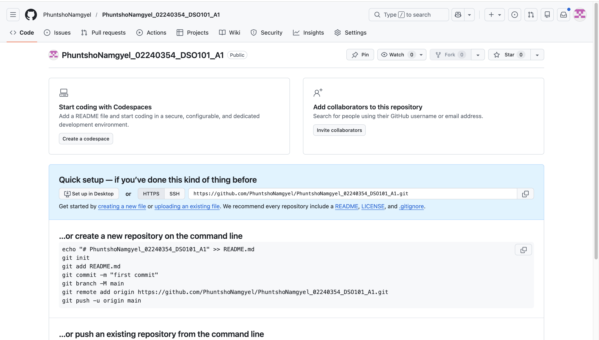

### Code Pushed to GitHub
After setting up the project structure locally, I pushed the initial commit to GitHub. This is the foundation for the automated deployment pipeline in Part B.

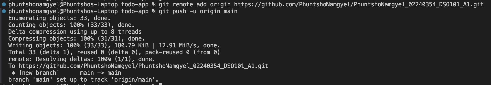

---

## Part A: Deploying Pre-built Docker Image

In Part A, the goal was to manually build Docker images for both the frontend and backend, push them to Docker Hub, and then deploy those images on Render. This simulates a workflow where the build and deployment steps are done manually before automating them.

### Step 1: Docker Login
Before pushing any images, I logged into Docker Hub from the terminal so that my local Docker client was authenticated.

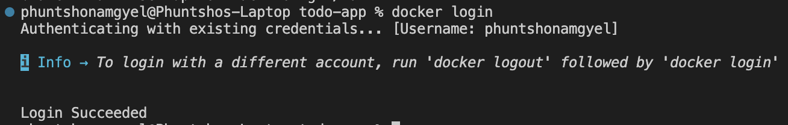

### Step 2: Build Backend Image
I built the backend Docker image using the Dockerfile inside the `backend/` folder. This packages the Node.js server and all its dependencies into a portable container image.

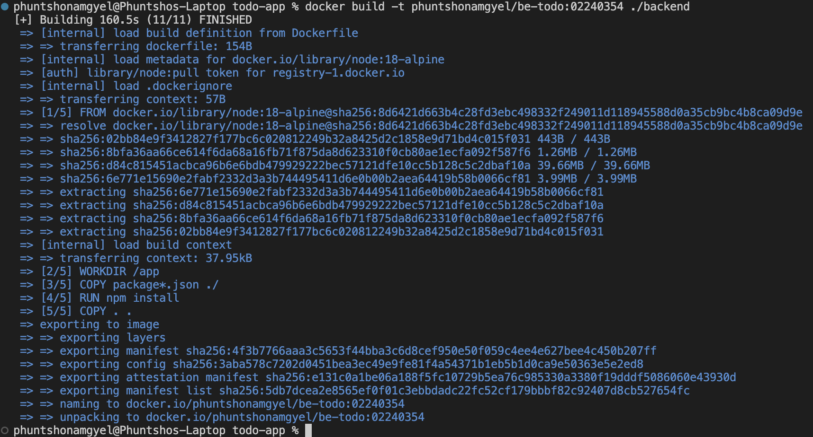

### Step 3: Push Backend Image to Docker Hub
After building, I pushed the backend image to my Docker Hub repository. Docker Hub acts as a registry where Render can pull the image from during deployment.

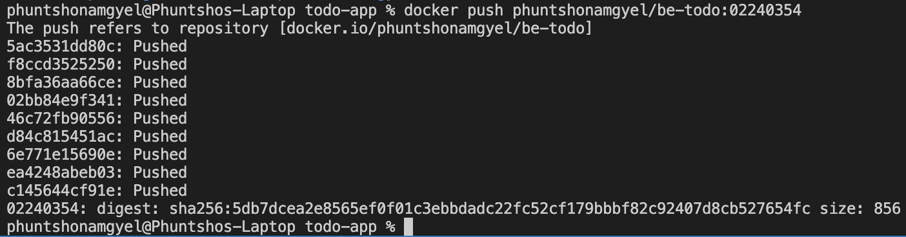

### Step 4: Build Frontend Image
I built the frontend Docker image using a two stage Dockerfile. The first stage builds the React app and the second stage serves it using a lightweight static file server.

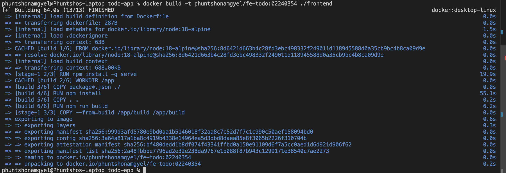

### Step 5: Push Frontend Image to Docker Hub
With the frontend image built, I pushed it to Docker Hub as well. Both images are now publicly accessible and ready to be deployed.

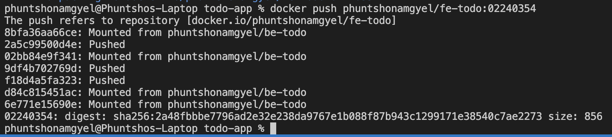

### Step 6: Both Images in Docker Desktop
Docker Desktop confirms both images are available locally. Note that the platform warning appeared because my Mac uses Apple Silicon. The images needed to be rebuilt targeting `linux/amd64` for Render compatibility.

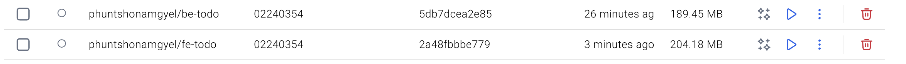

### Build Commands Used
Since I am on an Apple Silicon Mac, I had to use `docker buildx` with `--platform linux/amd64` to build images that Render's servers can run. The `--provenance=false` flag was needed to avoid multi-manifest issues.
```bash
# Build and push backend image for linux/amd64
docker buildx build --platform linux/amd64 --provenance=false \
  -t phuntshonamgyel/be-todo:02240354 ./backend --push

# Build and push frontend image for linux/amd64
docker buildx build --platform linux/amd64 --provenance=false \
  -t phuntshonamgyel/fe-todo:02240354 ./frontend --push
```

### Rebuilt Images for linux/amd64 Platform
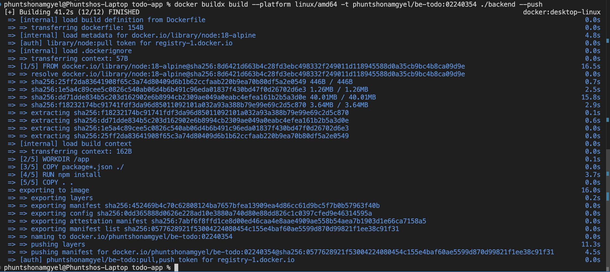
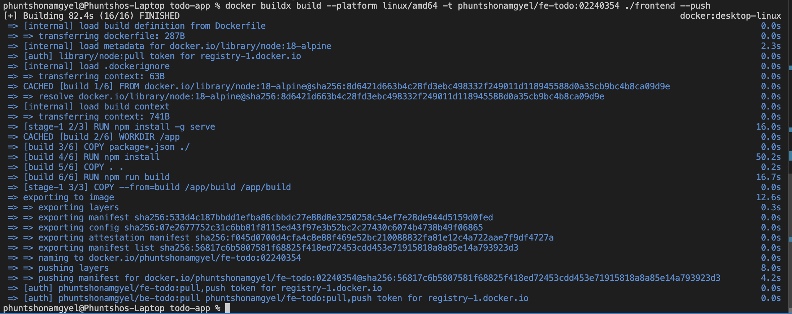

### Step 7: Render Dashboard
I signed up for Render using my GitHub account. Render is the cloud platform used to host both the backend and frontend services, as well as the PostgreSQL database.

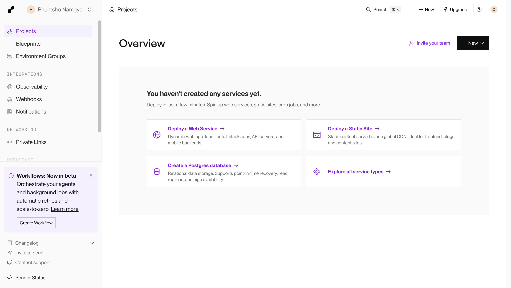

### Step 8: PostgreSQL Database Created
I created a managed PostgreSQL database on Render. Once it was available, I copied the connection credentials including the hostname, username, password, and database name to use as environment variables in the backend service.

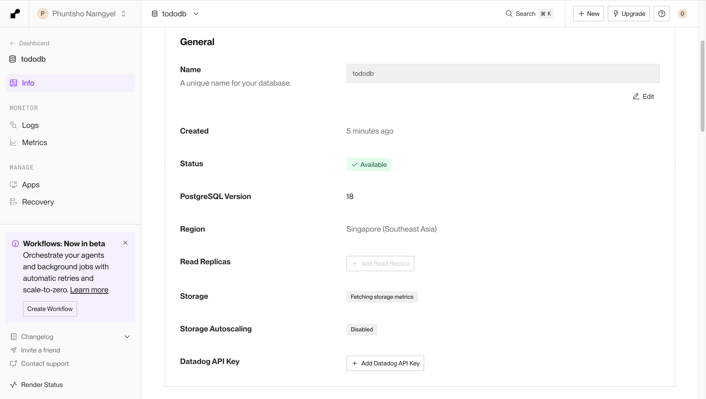
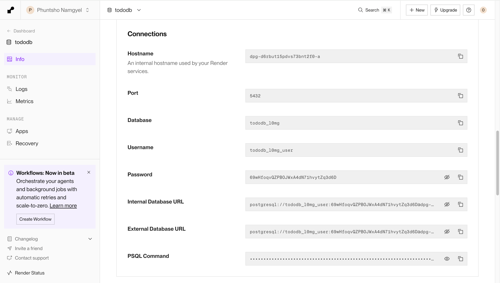

### Step 9: Deploy Backend Service from Docker Hub Image
I created a new Web Service on Render using the "Existing Image" option and pointed it to the backend image on Docker Hub. I then added all the required database environment variables so the backend could connect to PostgreSQL on startup.

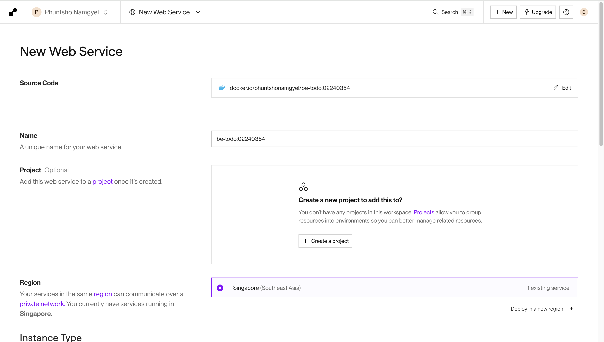
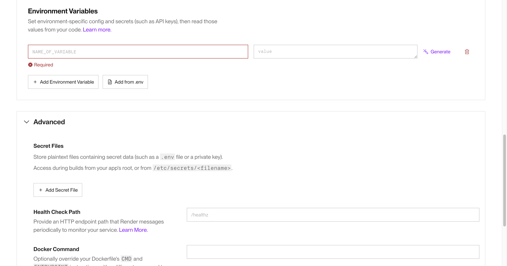
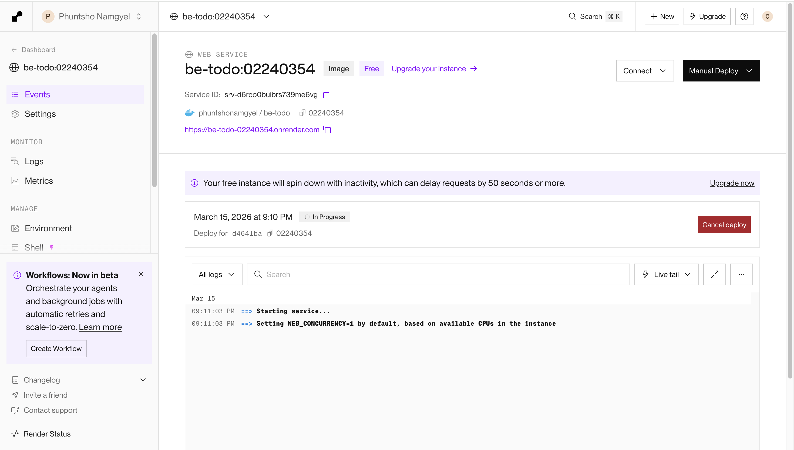
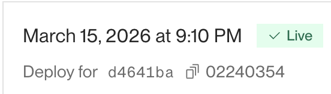

### Step 10: Deploy Frontend Service from Docker Hub Image
I repeated the same process for the frontend, this time setting the `REACT_APP_API_URL` environment variable to point to the live backend URL on Render.

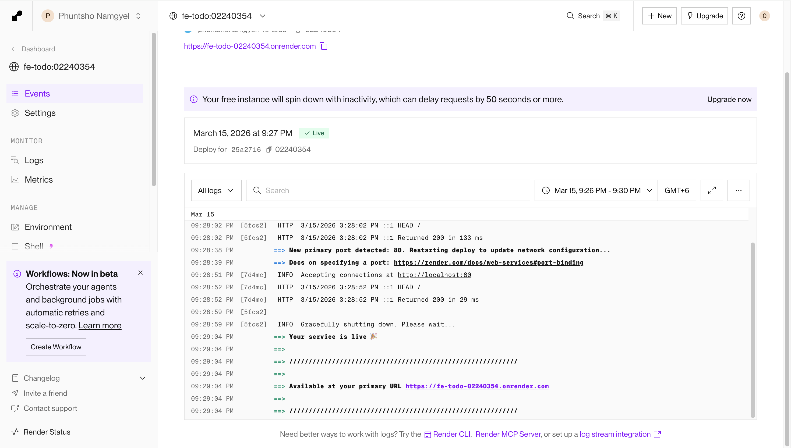

---

## Part B: Automated Image Build and Deployment

Part B extends the workflow by connecting Render directly to the GitHub repository. Instead of manually building and pushing Docker images, Render automatically builds a new image and redeploys the service every time a new commit is pushed to the `main` branch. This is where the actual CI/CD pipeline comes into play.

### Repository Structure
```
todo-app/
├── frontend/
│   ├── Dockerfile
│   ├── .env
│   └── src/
├── backend/
│   ├── Dockerfile
│   ├── .env
│   └── server.js
├── render.yaml
├── .gitignore
└── README.md
```

### render.yaml Configuration
The `render.yaml` file is a Blueprint configuration that tells Render how to build and deploy each service. It defines the Dockerfile paths, build contexts, instance plans, and environment variables for both the backend and frontend. This file replaces the manual setup done in Part A.
```yaml
services:
  - type: web
    name: be-todo
    runtime: docker
    dockerfilePath: ./backend/Dockerfile
    dockerContext: ./backend
    plan: free
    envVars:
      - key: DB_HOST
        sync: false
      - key: DB_USER
        sync: false
      - key: DB_PASSWORD
        sync: false
      - key: DB_NAME
        sync: false
      - key: DB_PORT
        value: 5432
      - key: PORT
        value: 5000

  - type: web
    name: fe-todo
    runtime: docker
    dockerfilePath: ./frontend/Dockerfile
    dockerContext: ./frontend
    plan: free
    envVars:
      - key: REACT_APP_API_URL
        sync: false
```

### Step 1: Push render.yaml to GitHub
After adding the `render.yaml` file to the project root, I committed and pushed it to GitHub. This triggered Render to detect the Blueprint and begin the automated deployment process.

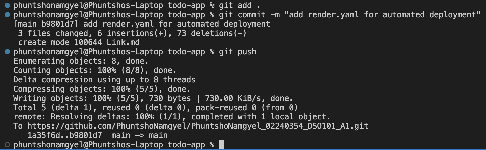

### Step 2: Automatic Deployment Triggered
Once the commit was pushed, Render automatically picked it up and started building fresh Docker images from the source code. This confirms the CI/CD pipeline is working as no manual build or push steps were needed this time.

### Step 3: Backend Service Live via Blueprint
Render successfully built the backend image from the GitHub source and deployed it. The Events page shows "New commit via Auto-Deploy", confirming the automation is working correctly.

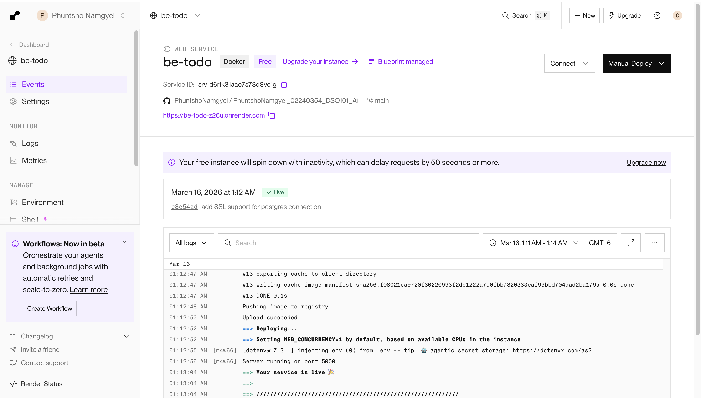

### Step 4: Frontend Service Live via Blueprint
The frontend was also automatically built and deployed by Render. Both services are now fully managed through the Blueprint and will redeploy on every future commit.

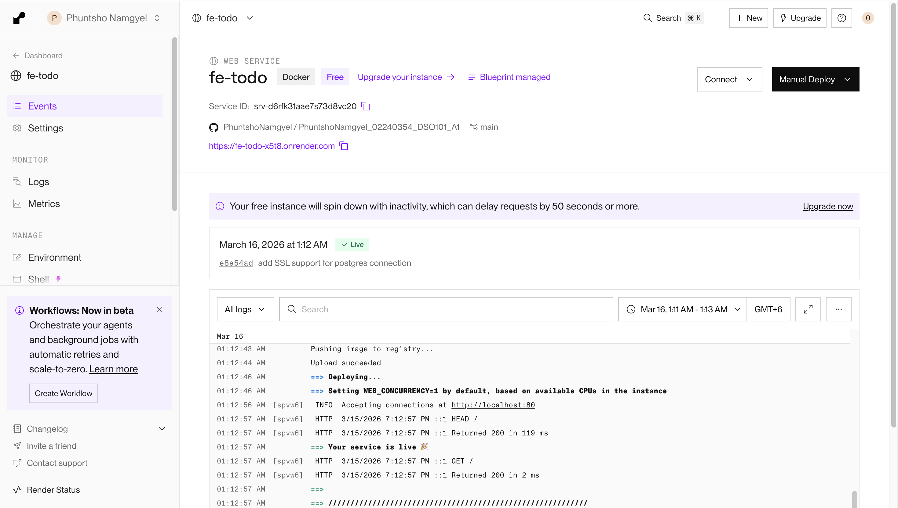

### Step 5: Live Todo Application
The fully deployed Todo application is accessible via the Render frontend URL. Tasks can be added, edited, deleted, and marked as complete. All data is persisted in the PostgreSQL database.

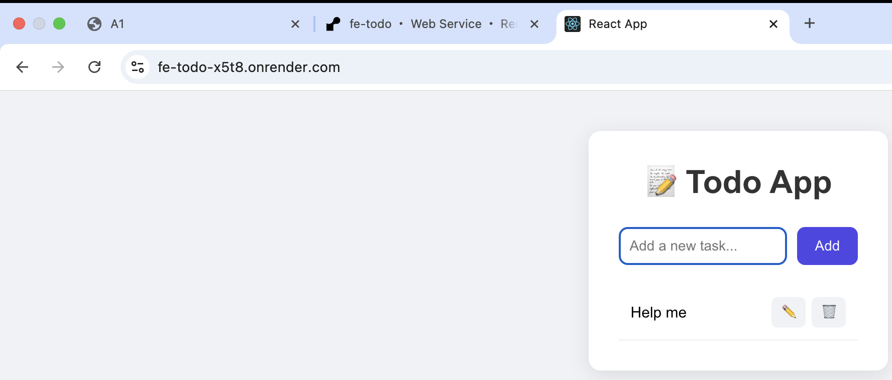

---

## Live URLs
- **Frontend:** https://fe-todo-x5t8.onrender.com
- **Backend:** https://be-todo-z26u.onrender.com

---

## Docker Hub Images
Both images are publicly available on Docker Hub and were used for deployment in Part A.

- `phuntshonamgyel/be-todo:02240354`
- `phuntshonamgyel/fe-todo:02240354`

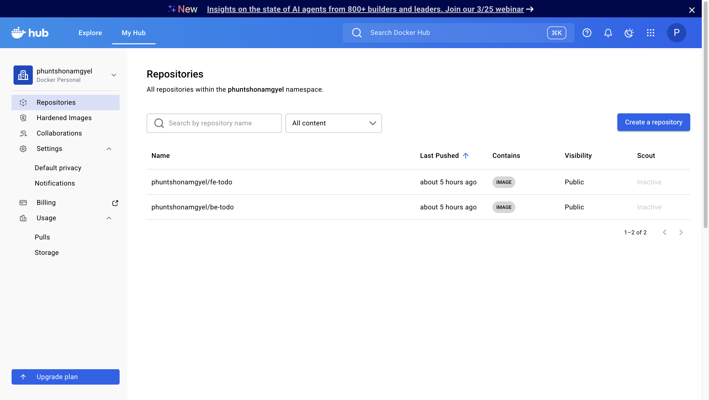

---

## Conclusion / Learning Outcome

Through this assignment, I gained practical experience with containerization and deployment workflows. I learned how Docker can be used to package applications into portable containers, making deployment more consistent across environments.

Using Docker Hub allowed me to store and distribute container images, while Render provided an easy way to deploy these services to the cloud. The `render.yaml` configuration also introduced the concept of automated deployment, where new commits pushed to GitHub automatically trigger a new build and deployment.

Overall, this assignment helped me understand how modern CI/CD pipelines work in real-world software development environments.

---

## References
- [Docker Documentation](https://docs.docker.com/)
- [Render Documentation](https://render.com/docs)
- [React Documentation](https://reactjs.org/)
- [Node.js Documentation](https://nodejs.org/)