# Assignment 2: Jenkins CI/CD Pipeline

## Objective
Configure a Jenkins pipeline to automate the build, test, and deployment of the Todo List application from Assignment 1.

---

## Tools & Technologies

| Tool | Purpose |
|------|---------|
| **Jenkins** | CI/CD automation |
| **GitHub** | Source code hosting |
| **Node.js & npm** | JavaScript runtime |
| **Jest** | Unit testing framework |
| **jest-junit** | JUnit XML report generation |
| **Docker** | Containerization |
| **Docker Hub** | Container registry |

---

## Pipeline Stages
```
Checkout → Install → Build → Test → Deploy
```

1. **Checkout** - Pulls latest code from GitHub
2. **Install** - Runs npm install in backend
3. **Build** - Runs npm install and npm run build in frontend
4. **Test** - Runs Jest tests and generates junit.xml
5. **Deploy** - Builds and pushes Docker image to Docker Hub

---

## Task 1: Jenkins Setup

### Installation
Jenkins was installed on macOS using Homebrew:
```bash
brew install jenkins-lts
brew services start jenkins-lts
```

### Step 1: Unlock Jenkins
After starting Jenkins, I retrieved the initial admin password and unlocked Jenkins at `http://localhost:8080`.

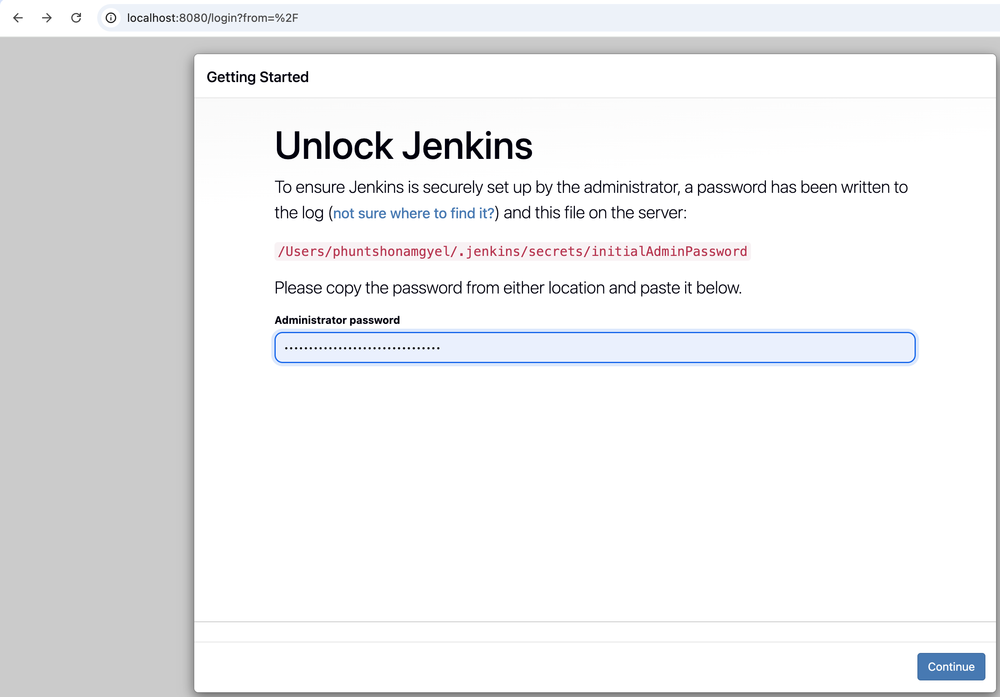

### Step 2: Install Suggested Plugins
Selected "Install suggested plugins" to set up Jenkins with the recommended plugins.

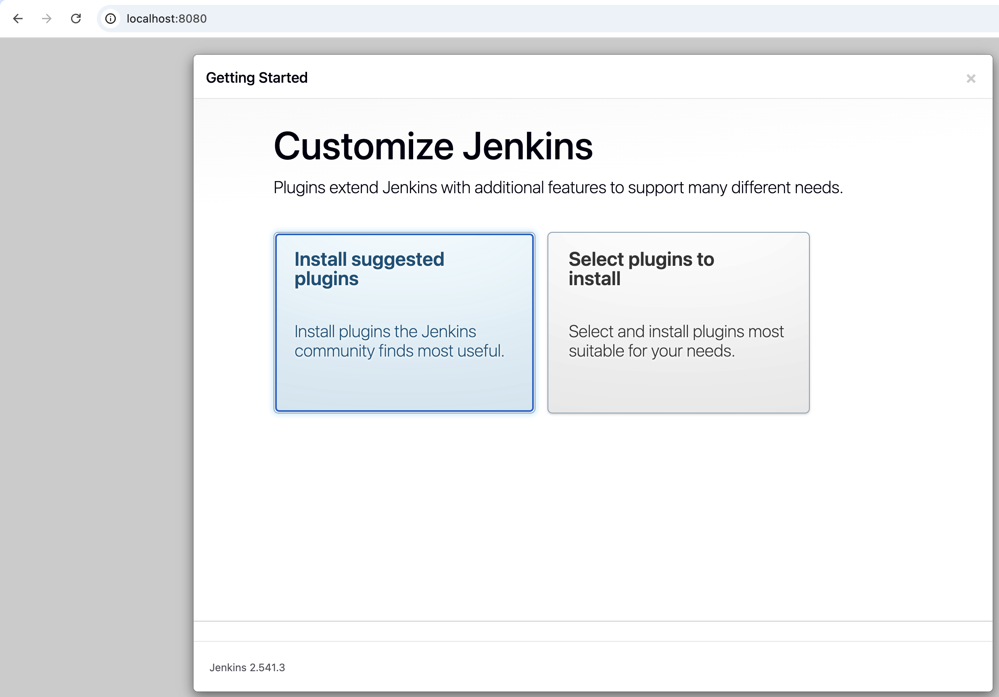

### Step 3: Create Admin User
Created the first admin user with my name and college email.

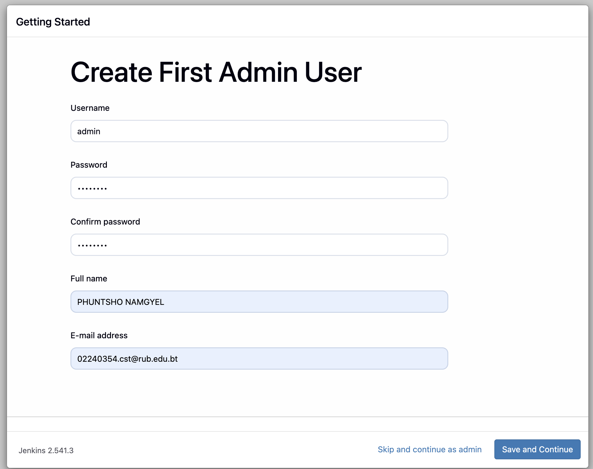

### Step 4: Jenkins Dashboard
Jenkins was successfully set up and ready to use.

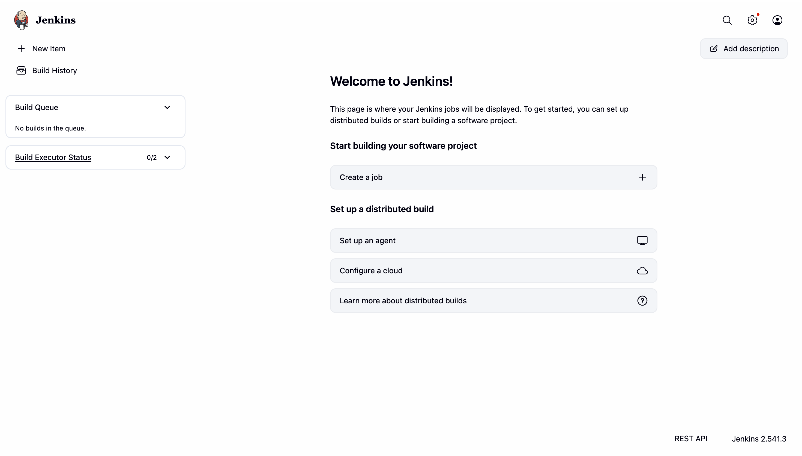

### Step 5: Configure Node.js Tool
Navigated to Manage Jenkins → Tools → NodeJS and configured NodeJS 20.15.1.

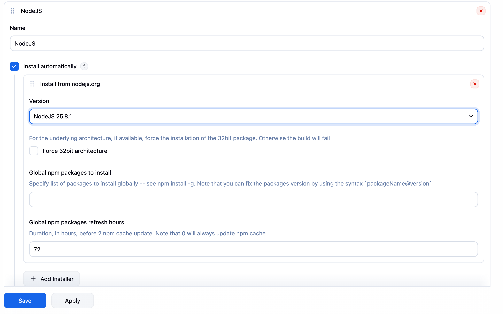

---

## Task 2: GitHub Repository Setup

### Step 6: Generate GitHub Personal Access Token
Generated a GitHub PAT with `repo` and `admin:repo_hook` permissions under Developer Settings.

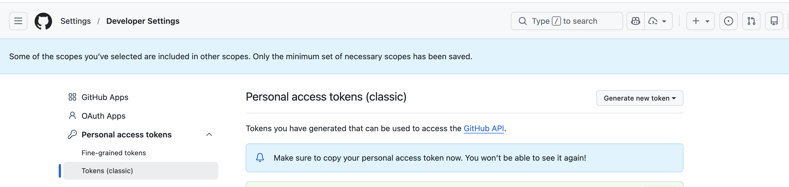

### Step 7: Add GitHub Credentials in Jenkins
Added GitHub credentials in Jenkins with ID `github-creds` using my GitHub username and PAT.

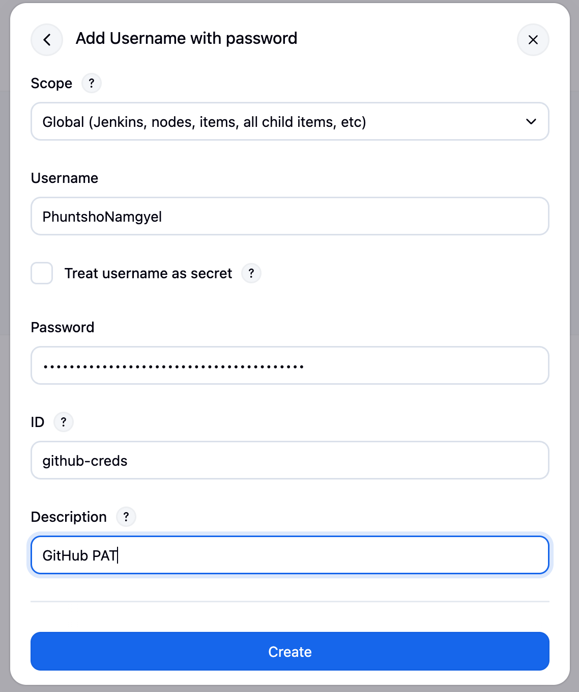

### Step 8: Add Docker Hub Credentials in Jenkins
Added Docker Hub credentials in Jenkins with ID `docker-hub-creds`.

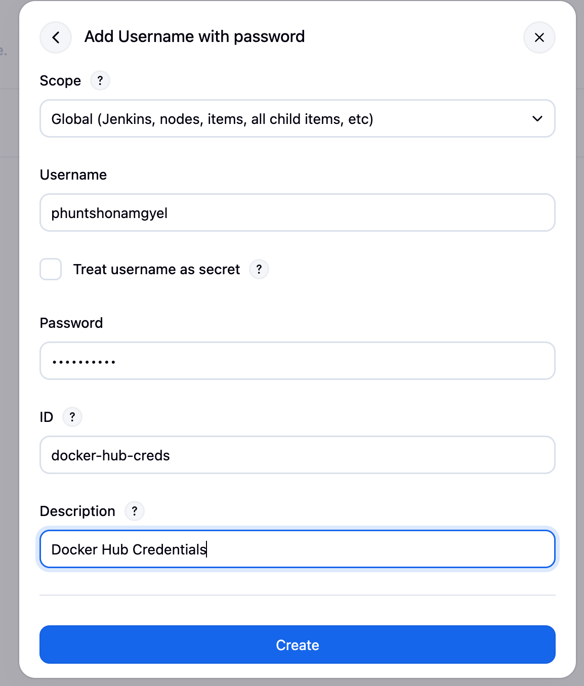

---

## Task 3: Jenkinsfile

### Step 9: Tests Passing Locally
Before setting up Jenkins, I verified all 3 Jest tests pass locally.

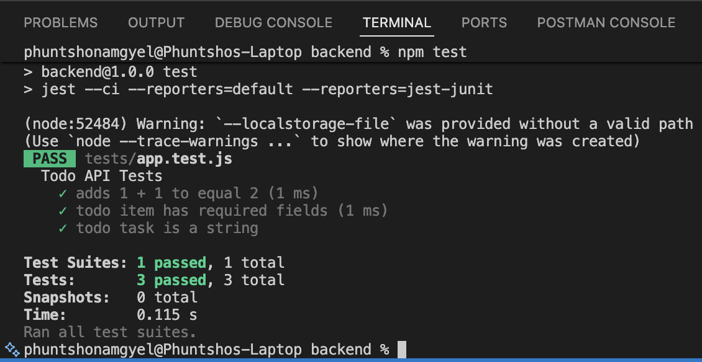

### Step 10: Push to GitHub
Pushed the Jenkinsfile, Jest tests, and updated package.json to GitHub.

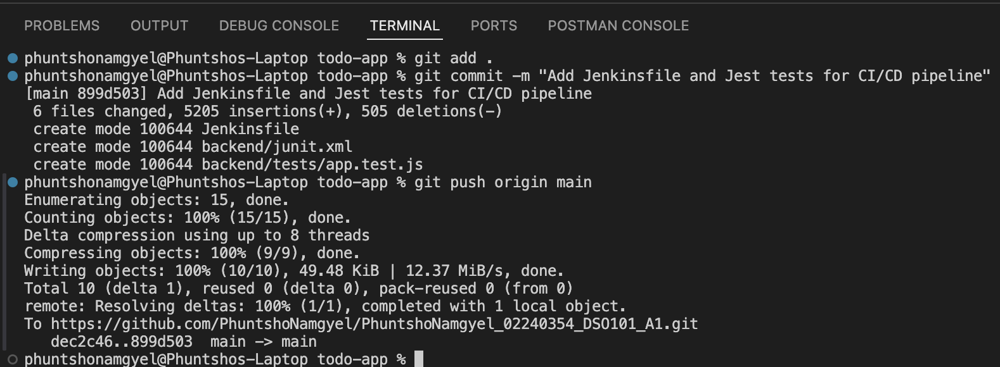

The Jenkinsfile is located in the root of the repository:
```groovy
pipeline {
    agent any
    tools {
        nodejs 'NodeJS'
    }
    environment {
        PATH = "/usr/local/bin:${env.PATH}"
    }
    stages {
        stage('Checkout') {
            steps {
                git branch: 'main',
                    credentialsId: 'github-creds',
                    url: 'https://github.com/PhuntshoNamgyel/PhuntshoNamgyel_02240354_DSO101_A1.git'
            }
        }
        stage('Install') {
            steps {
                dir('backend') {
                    sh 'npm install'
                }
            }
        }
        stage('Build') {
            steps {
                dir('frontend') {
                    sh 'npm install'
                    sh 'npm run build'
                }
            }
        }
        stage('Test') {
            steps {
                dir('backend') {
                    sh 'npm test'
                }
            }
            post {
                always {
                    junit 'backend/junit.xml'
                }
            }
        }
        stage('Deploy') {
            steps {
                script {
                    sh 'docker build -t phuntshonamgyel/be-todo:latest ./backend'
                    withCredentials([usernamePassword(credentialsId: 'docker-hub-creds', usernameVariable: 'DOCKER_USER', passwordVariable: 'DOCKER_PASS')]) {
                        sh 'echo $DOCKER_PASS | docker login -u $DOCKER_USER --password-stdin'
                        sh 'docker push phuntshonamgyel/be-todo:latest'
                    }
                }
            }
        }
    }
}
```

---

## Task 4: Pipeline Execution

### Step 11: Create Pipeline Job
Created a new Pipeline job in Jenkins called `todo-pipeline`.

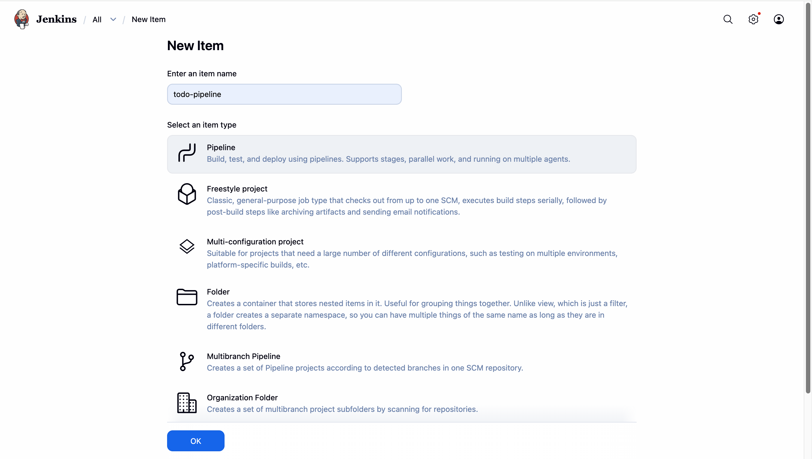

### Step 12: Configure Pipeline
Set Definition to `Pipeline script from SCM`, connected to GitHub repository using PAT credentials, and set Script Path to `Jenkinsfile`.

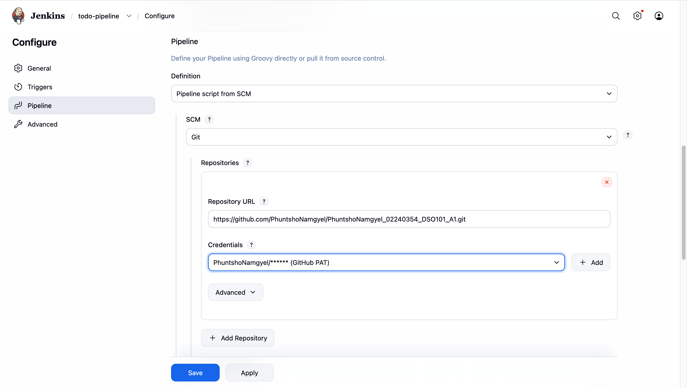

### Step 13: Pipeline Running
Clicked `Build Now` to trigger the first pipeline run.

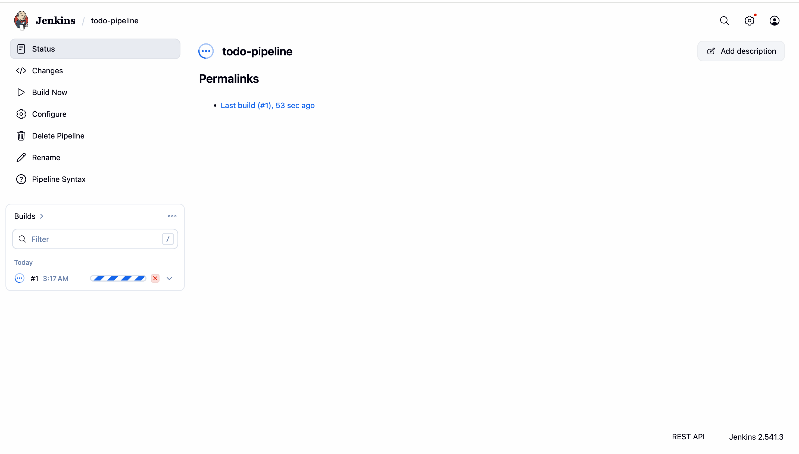

### Step 14: Pipeline Success
After fixing the Docker path issue, the pipeline ran successfully with all stages passing.

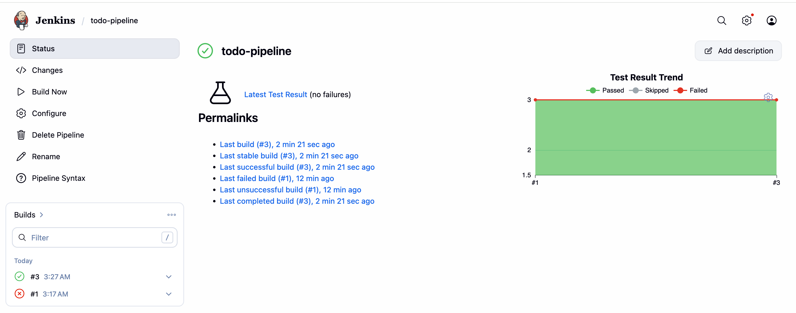

### Step 15: Test Results in Jenkins
All 3 Jest tests passed and results are visible in Jenkins UI.

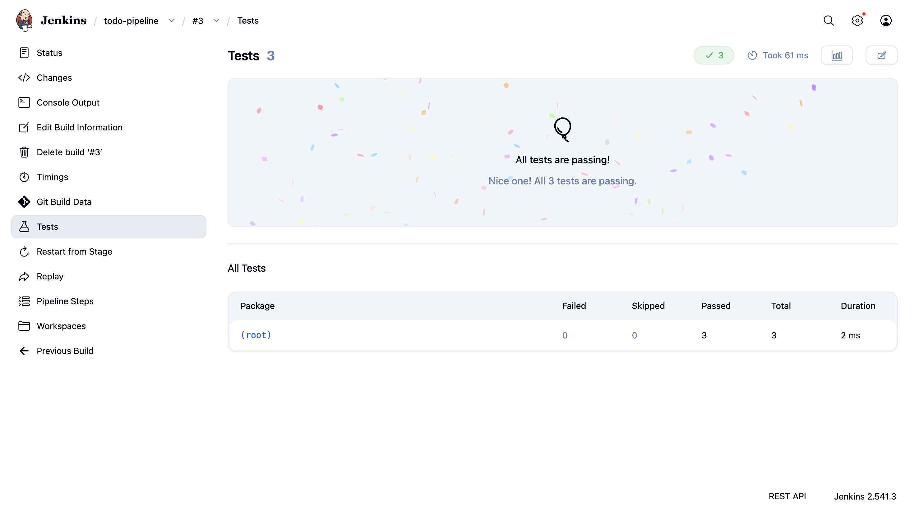

### Step 16: Docker Hub Image Pushed
Jenkins successfully built and pushed the Docker image to Docker Hub.

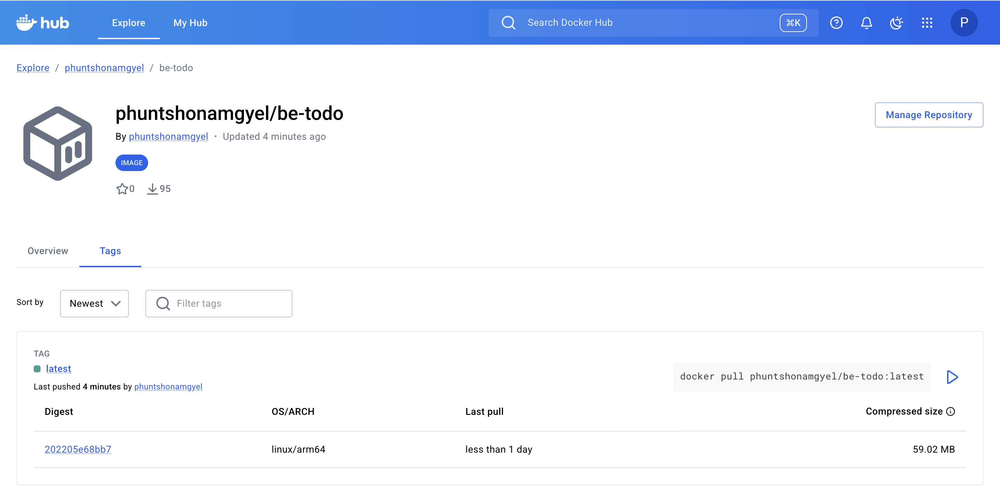

---

## Pipeline Results Summary

| Stage | Status |
|-------|--------|
| Checkout | ✅ Success |
| Install | ✅ Success |
| Build | ✅ Success |
| Test | ✅ 3/3 passed |
| Deploy | ✅ Image pushed |

---

## Test Results

3 unit tests written using Jest:
1. `adds 1 + 1 to equal 2`
2. `todo item has required fields`
3. `todo task is a string`

All tests passed and results were published in Jenkins as JUnit reports.

---

## Docker Hub Image
- **Image:** `phuntshonamgyel/be-todo:latest`
- **URL:** https://hub.docker.com/r/phuntshonamgyel/be-todo

---

## Challenges Faced

1. **Plugin Installation Failures** — Some suggested plugins failed to install during initial Jenkins setup. Fixed by clicking Retry and then continuing without the failed ones, then installing only the required plugins manually.

2. **Docker Not Found** — Jenkins could not find Docker during the Deploy stage (`docker: command not found`). Fixed by adding `/usr/local/bin` to the PATH environment variable in the Jenkinsfile.

3. **Apple Silicon Platform** — Since my Mac uses Apple Silicon (M-series), some tools behaved differently. Jenkins automatically downloaded the correct `darwin-arm64` version of Node.js.

---

## References
- [Jenkins Documentation](https://www.jenkins.io/doc/)
- [Jest Documentation](https://jestjs.io/)
- [Docker Documentation](https://docs.docker.com/)
- [GitHub PAT Documentation](https://docs.github.com/en/authentication/keeping-your-account-and-data-secure/managing-your-personal-access-tokens)