# Assignment 3: CI/CD Pipeline with GitHub Actions

---

## Steps Taken

**1. Verified GitHub Repository Setup**
- Confirmed repository is public
- Confirmed `package.json` has `start` and `test` scripts using Jest

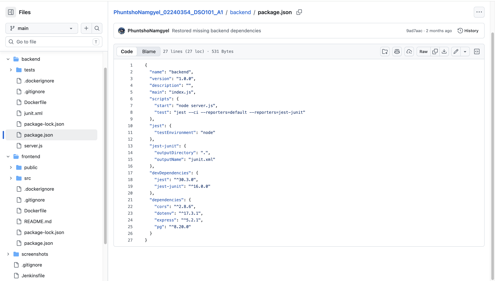
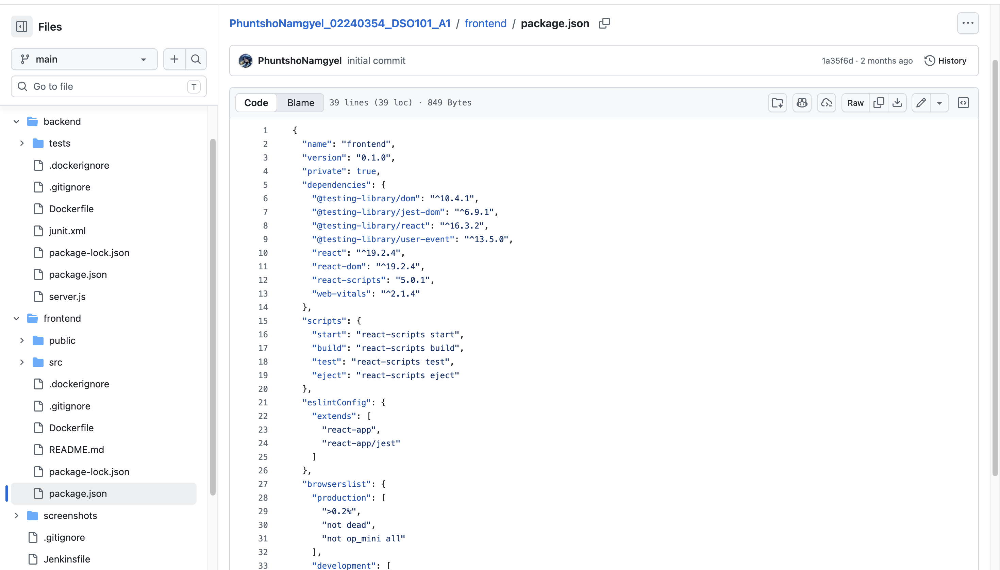

**2. Verified Dockerfiles**
- Confirmed backend and frontend both have working Dockerfiles
- Tested applications locally before proceeding

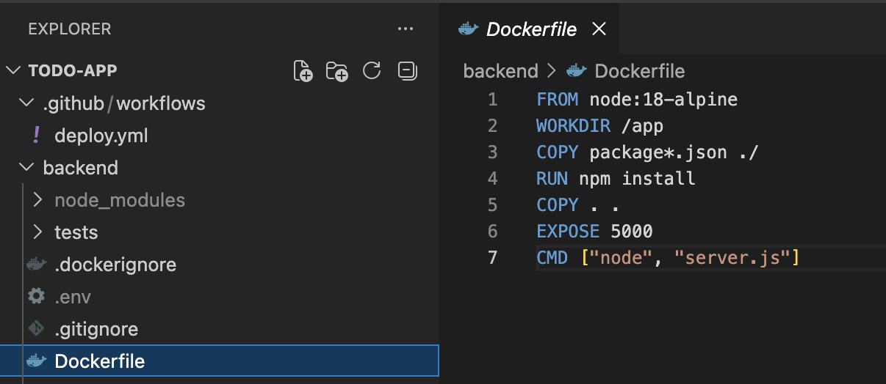
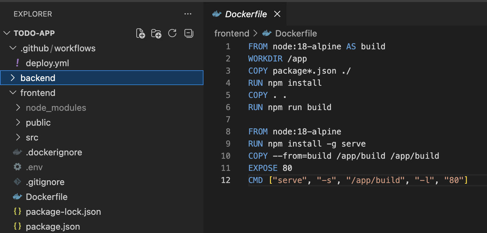

**3. Created GitHub Actions Workflow**
- Created `.github/workflows/deploy.yml` in the root of the repository
- Workflow triggers automatically on every push to `main` branch
- Pipeline steps:
  - Checkout repository
  - Login to Docker Hub using GitHub Secrets
  - Build and push backend Docker image to Docker Hub
  - Build and push frontend Docker image to Docker Hub
  - Trigger backend redeployment on Render via deploy webhook
  - Trigger frontend redeployment on Render via deploy webhook

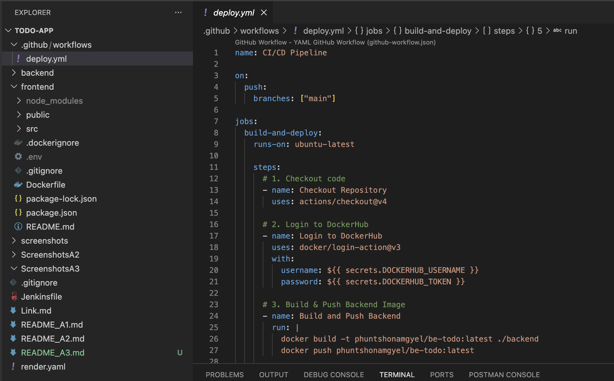

**4. Added GitHub Secrets**
- `DOCKERHUB_USERNAME` - Docker Hub account username
- `DOCKERHUB_TOKEN` - Docker Hub personal access token with read/write permission
- `RENDER_BACKEND_WEBHOOK` - Render deploy hook URL for `be-todo`
- `RENDER_FRONTEND_WEBHOOK` - Render deploy hook URL for `fe-todo`

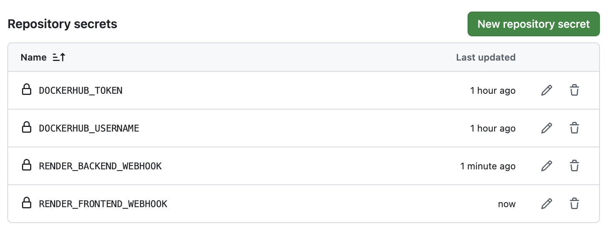

**5. Pushed to GitHub and Verified Pipeline**
- Pushed the workflow file to `main` branch
- GitHub Actions triggered automatically
- Pipeline completed successfully in 53 seconds

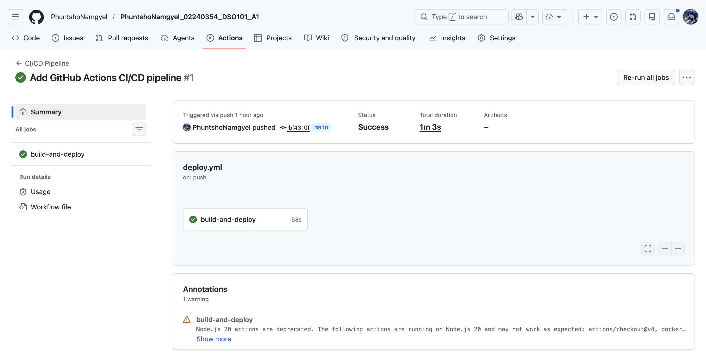

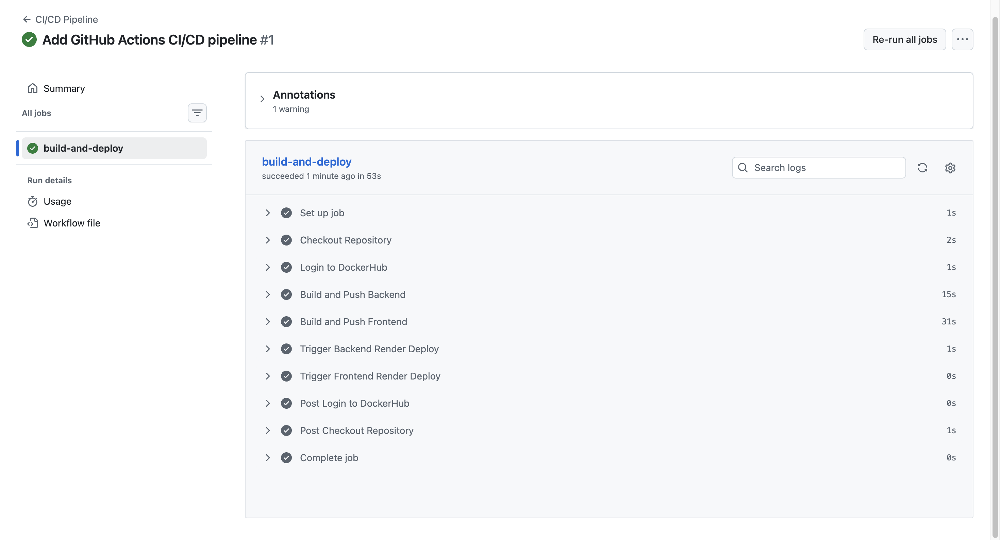

**6. Verified Docker Hub Images**
- Both backend and frontend images pushed successfully
- Both images are public

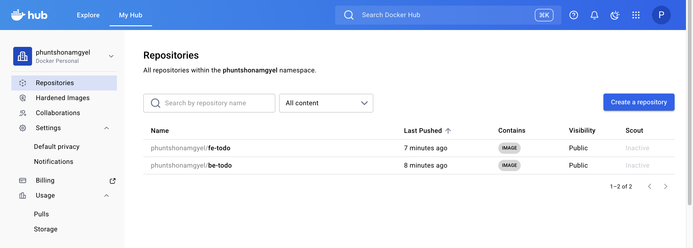

**7. Verified Render Deployment**
- Both services redeployed automatically via webhooks
- Backend and frontend updated 8 minutes after pipeline ran

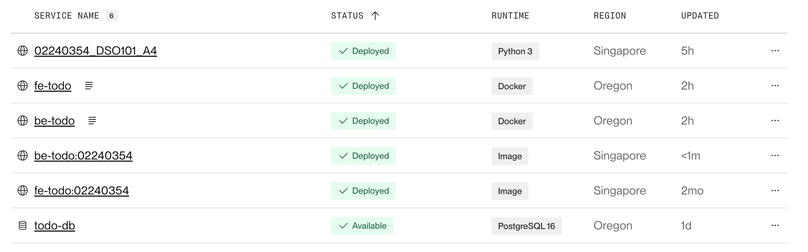

**8. Verified Live Application**
- Opened frontend URL and confirmed app is working
- Tested add, edit, and delete tasks successfully

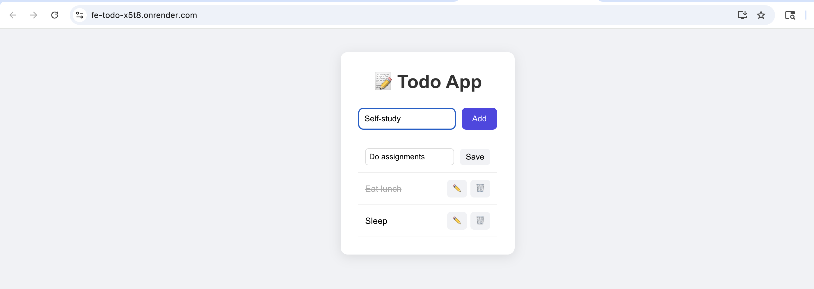

---

## Challenges Faced

- Render does not automatically redeploy when a new image is pushed to Docker Hub. This was solved by adding Render deploy webhook URLs as GitHub Secrets and triggering them at the end of the pipeline using `curl`.
- The free PostgreSQL database on Render had expired prior to this assignment. A new database was created and the backend environment variables were updated before proceeding.

---

## Learning Outcomes

- Understood how a full CI/CD pipeline works from a single `git push` to a live deployment
- Learned how to write and configure GitHub Actions workflow files
- Learned how to securely store and reference credentials using GitHub Secrets
- Learned how to automatically build and push Docker images using GitHub Actions
- Understood how to trigger Render deployments programmatically via webhooks
- Understood why credentials should never be hardcoded in workflow files

---

## Live Deployment

- **Frontend:** https://fe-todo-x5t8.onrender.com
- **Backend:** https://be-todo-z26u.onrender.com